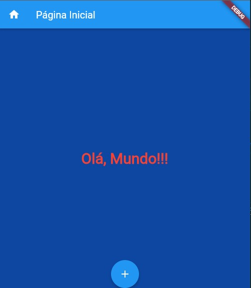
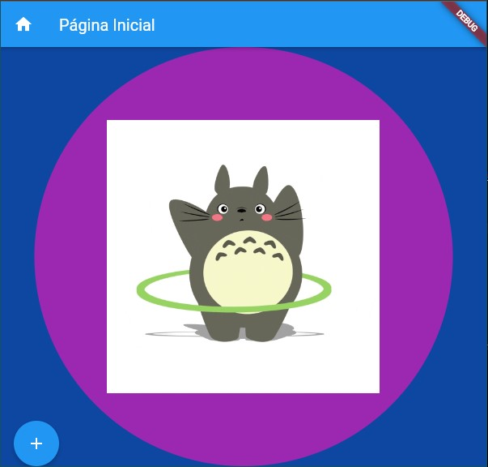

## Exercício do arquivo 08 - Flutter

O exercício pedia para alterar os exemplos da prática, para apresentar formatações na página e adicionar um gif.

Links para o Gif.

[GIF](https://media.giphy.com/media/pt0EKLDJmVvlS/giphy.gif)

Print com resultado final da Prática:

Exercício 1:

Exercício 2:

Exercício 3:

O [pdf](pdf/) desta prática se encontra em sua determinada pasta.
