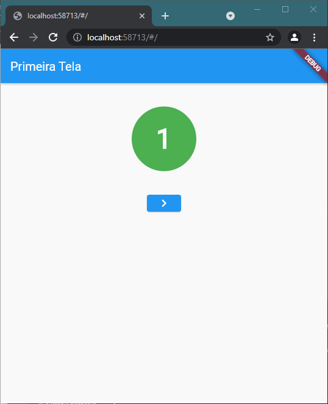

## Exercício do arquivo 13 - Flutter

O exercício pedia para alterar os exemplos da prática, para apresentar algumas telas.

Gif com resultado final da Prática:

O [pdf](pdf/) desta prática se encontra em sua determinada pasta.
